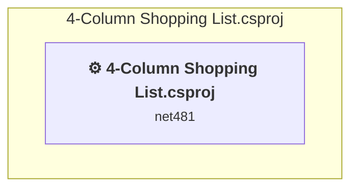

# Projects and dependencies analysis

This document provides a comprehensive overview of the projects and their dependencies in the context of upgrading to .NETCoreApp,Version=v10.0.

## Table of Contents

- [Executive Summary](#executive-Summary)
  - [Highlevel Metrics](#highlevel-metrics)
  - [Projects Compatibility](#projects-compatibility)
  - [Package Compatibility](#package-compatibility)
  - [API Compatibility](#api-compatibility)
  - [Binding Redirect Configuration](#binding-redirect-configuration)
- [Aggregate NuGet packages details](#aggregate-nuget-packages-details)
- [Top API Migration Challenges](#top-api-migration-challenges)
  - [Technologies and Features](#technologies-and-features)
  - [Most Frequent API Issues](#most-frequent-api-issues)
- [Projects Relationship Graph](#projects-relationship-graph)
- [Project Details](#project-details)

  - [4-Column Shopping List.csproj](#4-column-shopping-listcsproj)

## Executive Summary

### Highlevel Metrics

| Metric | Count | Status |
| :--- | :---: | :--- |
| Total Projects | 1 | All require upgrade |
| Total NuGet Packages | 0 | All compatible |
| Total Code Files | 6 |  |
| Total Code Files with Incidents | 5 |  |
| Total Lines of Code | 970 |  |
| Total Number of Issues | 1124 |  |
| Estimated LOC to modify | 1122+ | at least 115.7% of codebase |

### Projects Compatibility

| Project | Target Framework | Difficulty | Package Issues | API Issues | Binding Issues | Est. LOC Impact | Description |
| :--- | :---: | :---: | :---: | :---: | :---: | :---: | :--- |
| [4-Column Shopping List.csproj](#4-column-shopping-listcsproj) | net481 | 🟡 Medium | 0 | 1122 | 0 | 1122+ | ClassicWinForms, Sdk Style = False |

### Package Compatibility

| Status | Count | Percentage |
| :--- | :---: | :---: |
| ✅ Compatible | 0 | 0.0% |
| ⚠️ Incompatible | 0 | 0.0% |
| 🔄 Upgrade Recommended | 0 | 0.0% |
| ***Total NuGet Packages*** | ***0*** | ***100%*** |

### API Compatibility

| Category | Count | Impact |
| :--- | :---: | :--- |
| 🔴 Binary Incompatible | 1068 | High - Require code changes |
| 🟡 Source Incompatible | 54 | Medium - Needs re-compilation and potential conflicting API error fixing |
| 🔵 Behavioral change | 0 | Low - Behavioral changes that may require testing at runtime |
| ✅ Compatible | 652 |  |
| ***Total APIs Analyzed*** | ***1774*** |  |

## Aggregate NuGet packages details

| Package | Current Version | Suggested Version | Projects | Description |
| :--- | :---: | :---: | :--- | :--- |

## Top API Migration Challenges

### Technologies and Features

| Technology | Issues | Percentage | Migration Path |
| :--- | :---: | :---: | :--- |
| Windows Forms | 1068 | 95.2% | Windows Forms APIs for building Windows desktop applications with traditional Forms-based UI that are available in .NET on Windows. Enable Windows Desktop support: Option 1 (Recommended): Target net9.0-windows; Option 2: Add <UseWindowsDesktop>true</UseWindowsDesktop>; Option 3 (Legacy): Use Microsoft.NET.Sdk.WindowsDesktop SDK. |
| GDI+ / System.Drawing | 24 | 2.1% | System.Drawing APIs for 2D graphics, imaging, and printing that are available via NuGet package System.Drawing.Common. Note: Not recommended for server scenarios due to Windows dependencies; consider cross-platform alternatives like SkiaSharp or ImageSharp for new code. |
| Speech & Voice Recognition | 24 | 2.1% | System.Speech APIs for speech recognition and synthesis that are not available in .NET Core/.NET. These Windows-specific APIs have been superseded by cloud-based services. Use Azure Cognitive Services Speech or other modern speech APIs. |
| Legacy Configuration System | 6 | 0.5% | Legacy XML-based configuration system (app.config/web.config) that has been replaced by a more flexible configuration model in .NET Core. The old system was rigid and XML-based. Migrate to Microsoft.Extensions.Configuration with JSON/environment variables; use System.Configuration.ConfigurationManager NuGet package as interim bridge if needed. |

### Most Frequent API Issues

| API | Count | Percentage | Category |
| :--- | :---: | :---: | :--- |
| T:System.Windows.Forms.TextBox | 132 | 11.8% | Binary Incompatible |
| T:System.Windows.Forms.ToolStripMenuItem | 114 | 10.2% | Binary Incompatible |
| T:System.Windows.Forms.ListBox | 97 | 8.6% | Binary Incompatible |
| T:System.Windows.Forms.Keys | 60 | 5.3% | Binary Incompatible |
| T:System.Windows.Forms.Label | 44 | 3.9% | Binary Incompatible |
| T:System.Windows.Forms.Form | 33 | 2.9% | Binary Incompatible |
| P:System.Windows.Forms.Control.Name | 20 | 1.8% | Binary Incompatible |
| T:System.Windows.Forms.Control.ControlCollection | 17 | 1.5% | Binary Incompatible |
| P:System.Windows.Forms.Control.Controls | 17 | 1.5% | Binary Incompatible |
| M:System.Windows.Forms.Control.ControlCollection.Add(System.Windows.Forms.Control) | 17 | 1.5% | Binary Incompatible |
| P:System.Windows.Forms.Control.TabIndex | 17 | 1.5% | Binary Incompatible |
| P:System.Windows.Forms.Control.Size | 17 | 1.5% | Binary Incompatible |
| P:System.Windows.Forms.Control.Location | 17 | 1.5% | Binary Incompatible |
| T:System.Windows.Forms.MenuStrip | 16 | 1.4% | Binary Incompatible |
| T:System.Windows.Forms.ListBox.ObjectCollection | 15 | 1.3% | Binary Incompatible |
| P:System.Windows.Forms.ListBox.Items | 15 | 1.3% | Binary Incompatible |
| T:System.Speech.Synthesis.SpeechSynthesizer | 13 | 1.2% | Source Incompatible |
| P:System.Windows.Forms.ToolStripItem.Text | 13 | 1.2% | Binary Incompatible |
| P:System.Windows.Forms.ToolStripItem.Size | 13 | 1.2% | Binary Incompatible |
| P:System.Windows.Forms.ToolStripItem.Name | 13 | 1.2% | Binary Incompatible |
| M:System.Windows.Forms.ToolStripMenuItem.#ctor | 13 | 1.2% | Binary Incompatible |
| P:System.Windows.Forms.Control.CausesValidation | 12 | 1.1% | Binary Incompatible |
| P:System.Windows.Forms.Control.AccessibleName | 12 | 1.1% | Binary Incompatible |
| P:System.Windows.Forms.Control.AccessibleDescription | 12 | 1.1% | Binary Incompatible |
| T:System.Windows.Forms.HorizontalAlignment | 12 | 1.1% | Binary Incompatible |
| P:System.Windows.Forms.TextBox.Text | 10 | 0.9% | Binary Incompatible |
| E:System.Windows.Forms.ToolStripItem.Click | 10 | 0.9% | Binary Incompatible |
| P:System.Windows.Forms.ToolStripMenuItem.ShortcutKeys | 10 | 0.9% | Binary Incompatible |
| T:System.Windows.Forms.FormStartPosition | 9 | 0.8% | Binary Incompatible |
| T:System.Windows.Forms.SizeGripStyle | 9 | 0.8% | Binary Incompatible |
| T:System.Windows.Forms.FormBorderStyle | 9 | 0.8% | Binary Incompatible |
| T:System.Windows.Forms.MessageBoxIcon | 8 | 0.7% | Binary Incompatible |
| T:System.Windows.Forms.MessageBoxButtons | 8 | 0.7% | Binary Incompatible |
| T:System.Drawing.FontStyle | 8 | 0.7% | Source Incompatible |
| T:System.Drawing.Font | 8 | 0.7% | Source Incompatible |
| F:System.Windows.Forms.Keys.Control | 8 | 0.7% | Binary Incompatible |
| T:System.Windows.Forms.KeyEventHandler | 8 | 0.7% | Binary Incompatible |
| M:System.Windows.Forms.TextBox.#ctor | 8 | 0.7% | Binary Incompatible |
| T:System.Windows.Forms.DialogResult | 6 | 0.5% | Binary Incompatible |
| T:System.Windows.Forms.Padding | 6 | 0.5% | Binary Incompatible |
| P:System.Configuration.ApplicationSettingsBase.Item(System.String) | 4 | 0.4% | Source Incompatible |
| M:System.Windows.Forms.ListBox.ObjectCollection.Clear | 4 | 0.4% | Binary Incompatible |
| T:System.Windows.Forms.MessageBox | 4 | 0.4% | Binary Incompatible |
| P:System.Windows.Forms.Control.Focused | 4 | 0.4% | Binary Incompatible |
| T:System.Windows.Forms.Application | 4 | 0.4% | Binary Incompatible |
| T:System.Windows.Forms.KeyEventArgs | 4 | 0.4% | Binary Incompatible |
| P:System.Windows.Forms.KeyEventArgs.SuppressKeyPress | 4 | 0.4% | Binary Incompatible |
| P:System.Windows.Forms.KeyEventArgs.Handled | 4 | 0.4% | Binary Incompatible |
| F:System.Windows.Forms.Keys.Enter | 4 | 0.4% | Binary Incompatible |
| P:System.Windows.Forms.KeyEventArgs.KeyCode | 4 | 0.4% | Binary Incompatible |

## Projects Relationship Graph

Legend:
📦 SDK-style project
⚙️ Classic project

## Project Details

### 4-Column Shopping List.csproj

#### Project Info

- **Current Target Framework:** net481
- **Proposed Target Framework:** net10.0-windows
- **SDK-style**: False
- **Project Kind:** ClassicWinForms
- **Dependencies**: 0
- **Dependants**: 0
- **Number of Files**: 8
- **Number of Files with Incidents**: 5
- **Lines of Code**: 970
- **Estimated LOC to modify**: 1122+ (at least 115.7% of the project)

#### Dependency Graph

Legend:
📦 SDK-style project
⚙️ Classic project

### API Compatibility

| Category | Count | Impact |
| :--- | :---: | :--- |
| 🔴 Binary Incompatible | 1068 | High - Require code changes |
| 🟡 Source Incompatible | 54 | Medium - Needs re-compilation and potential conflicting API error fixing |
| 🔵 Behavioral change | 0 | Low - Behavioral changes that may require testing at runtime |
| ✅ Compatible | 652 |  |
| ***Total APIs Analyzed*** | ***1774*** |  |

#### Project Technologies and Features

| Technology | Issues | Percentage | Migration Path |
| :--- | :---: | :---: | :--- |
| Legacy Configuration System | 6 | 0.5% | Legacy XML-based configuration system (app.config/web.config) that has been replaced by a more flexible configuration model in .NET Core. The old system was rigid and XML-based. Migrate to Microsoft.Extensions.Configuration with JSON/environment variables; use System.Configuration.ConfigurationManager NuGet package as interim bridge if needed. |
| GDI+ / System.Drawing | 24 | 2.1% | System.Drawing APIs for 2D graphics, imaging, and printing that are available via NuGet package System.Drawing.Common. Note: Not recommended for server scenarios due to Windows dependencies; consider cross-platform alternatives like SkiaSharp or ImageSharp for new code. |
| Speech & Voice Recognition | 24 | 2.1% | System.Speech APIs for speech recognition and synthesis that are not available in .NET Core/.NET. These Windows-specific APIs have been superseded by cloud-based services. Use Azure Cognitive Services Speech or other modern speech APIs. |
| Windows Forms | 1068 | 95.2% | Windows Forms APIs for building Windows desktop applications with traditional Forms-based UI that are available in .NET on Windows. Enable Windows Desktop support: Option 1 (Recommended): Target net9.0-windows; Option 2: Add <UseWindowsDesktop>true</UseWindowsDesktop>; Option 3 (Legacy): Use Microsoft.NET.Sdk.WindowsDesktop SDK. |

